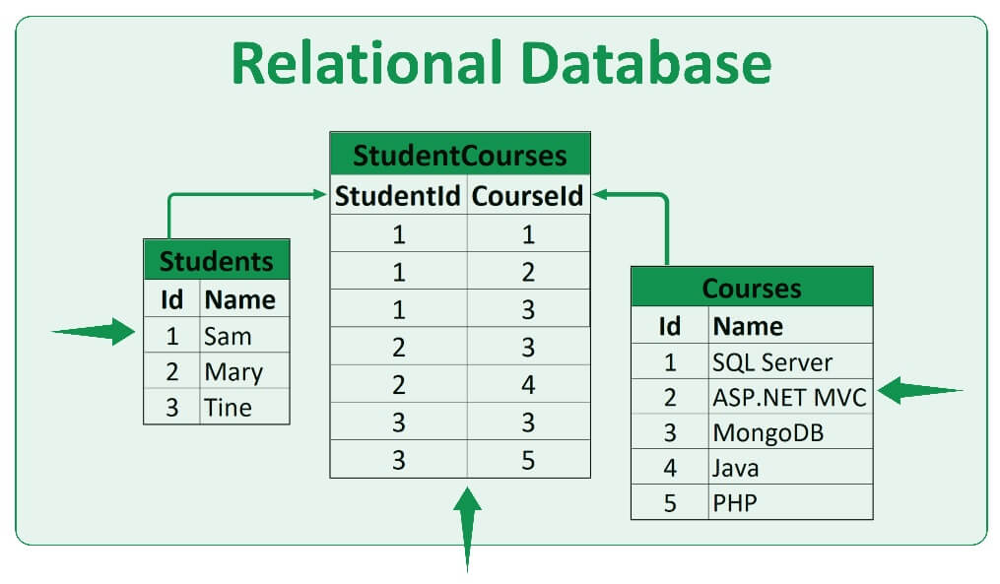
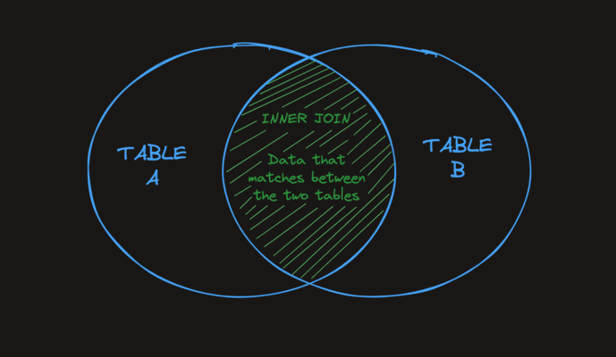
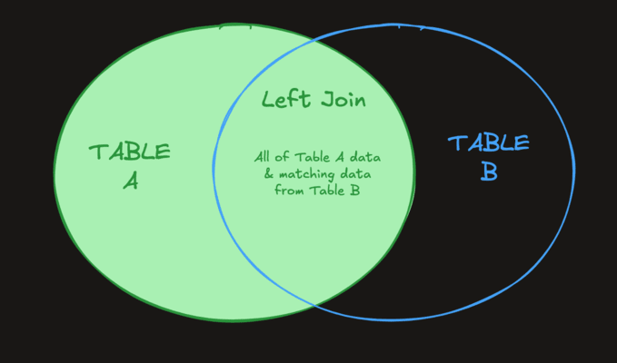
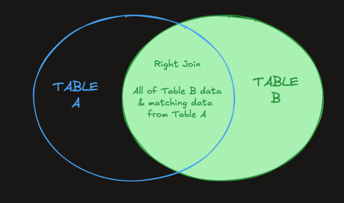
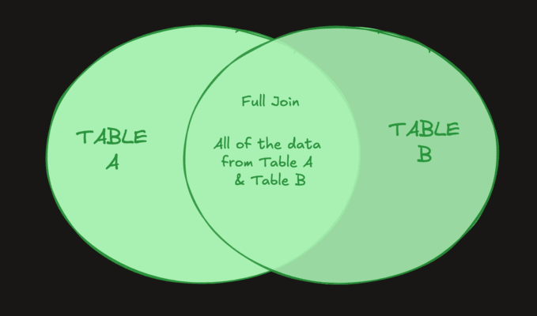

While most relational databases are fairly similar, NoSQL databases tend to be fairly unique and are used for more niche purposes.

Some of the main differences between a SQL and NoSQL databases are:

- NoSQL databases are usually non-relational, SQL databases are usually relational (we'll talk more about what this means later).
- SQL databases usually have a defined schema, NoSQL databases usually have dynamic schema.
- SQL databases are table-based, NoSQL databases have a variety of different storage methods, such as document, key-value, graph, wide-column, and more.

Types of NoSQL Databases
- Document Database
- Key-Value Store
- Wide-Column
- Graph

A few of the most popular NoSQL databases are:
- MongoDB
- Cassandra
- CouchDB
- DynamoDB
- ElasticSearch

## Intro to Migrations

A database migration is **a set of changes** to a relational database. In fact, the ALTER TABLE statements we did in the last exercise were examples of migrations!

Migrations are helpful when transitioning from one state to another, fixing mistakes, or adapting a database to changes.

Good migrations are small, incremental and ideally reversible changes to a database. As you can imagine, when working with large databases, making changes can be scary! We have to be careful when writing database migrations so that we don't break any systems that depend on the old database schema.

When writing reversible migrations, we use the terms "up" and "down" migrations. An "up" migration is simply the set of changes you want to make, like altering/removing/adding/editing a table in some way. A "down" migration includes the changes that would revert any of the "up" migration's changes.

## Constrains

In SQL, a cell with a NULL value indicates that the value is missing. A NULL value is very different from a zero value.

A constraint is a rule we create on a database that enforces some specific behavior. For example, setting a NOT NULL constraint on a column ensures that the column will not accept NULL values.

If we try to insert a NULL value into a column with the NOT NULL constraint, the insert will fail with an error message. Constraints are extremely useful when we need to ensure that certain kinds of data exist within our database.

## Keys

A key defines and protects relationships between tables. A primary key is a special column that uniquely identifies records within a table. Each table can have one, and only one primary key.

Foreign keys are what makes relational databases relational! Foreign keys define the relationships between tables. Simply put, a FOREIGN KEY is a field in one table that references another table's PRIMARY KEY.

## There Is No Perfect Way to Architect a Database Schema

When designing a database schema there typically isn't a "correct" solution. We do our best to choose a sane set of tables, fields, constraints, etc that will accomplish our project's goals. Like many things in programming, different schema designs come with different tradeoffs.

## Relational Databases

A relational database is a type of database that stores data so that it can be easily related to other data.

For example, a user can have many tweets. There's a relationship between a user and their tweet.

In a relational database:

1. Data is typically represented in "tables".
2. Each table has "columns" or "fields" that hold attributes related to the record.
3. Each row or entry in the table is called a record.
4. Typically, each record has a unique Id called the primary key.



## Relational vs. Non-Relational Databases

The big difference between relational and non-relational databases is that non-relational databases nest their data. Instead of keeping records on separate tables, they store records within other records.

To over-simplify it, you can think of non-relational databases as giant JSON blobs. If a user can have multiple courses, you might just add all the courses to the user record.

This often results in duplicate data within the database. That's obviously less than ideal, but it does have some benefits.

## HTTP CRUD Database Lifecycle

Here's how we could engineer GET request:

First, the front-end webpage loads.
The front-end sends an HTTP GET request to a /users endpoint on the back-end server.
The server receives the request.
The server uses a SELECT statement to retrieve the user's record from the users table in the database.
The server converts the row of SQL data into a JSON object and sends it back to the front-end.

## WHERE

You can use a WHERE clause to filter values by whether or not they're NULL.

### IS NULL
```sql
SELECT name FROM users WHERE first_name IS NULL;
```

### IS NOT NULL
```sql
SELECT name FROM users WHERE first_name IS NOT NULL;
```

## DELETING STRATEGY

### Strategy 1 - Backups
If you're using a cloud-service like GCP's Cloud SQL or AWS's RDS you should always turn on automated backups. They take an automatic snapshot of your entire database on some interval, and keep it around for some length of time.

For example, the Boot.dev database has a backup snapshot taken daily and we retain those backups for 30 days. If I ever accidentally run a query that deletes valuable data, I can restore it from the backup.

You should have a backup strategy for production databases.

### Strategy 2 - Soft Deletes
A "soft delete" is when you don't actually delete data from your database, but instead just "mark" the data as deleted. For example, you might set a deleted_at date on the row you want to delete. Then, in your queries you ignore anything that has a deleted_at date set. The idea is that this allows your application to behave as if it's deleting data, but you can always go back and restore any data that's been removed.

## Object-Relational Mapping (ORMs)
An Object-Relational Mapping or an ORM for short, is a tool that allows you to perform CRUD operations on a database using a traditional programming language.
These typically come in the form of a library or framework that you would use in your backend code.

The primary benefit an ORM provides is that it maps your database records to in-memory objects.

## AS clause
Sometimes we need to structure the data we return from our queries in a specific way. An AS clause allows us to "alias" a piece of data in our query. The alias only exists for the duration of the query.

As Keyword
The following queries return the same data:

```sql
SELECT employee_id AS id, employee_name AS name
FROM employees;

SELECT employee_id, employee_name
FROM employees;
```

The difference is that the results from the aliased query would have column names id and name instead of employee_id and employee_name.

## In
Another variation to the WHERE clause we can utilize is the IN operator. IN returns true or false if the first operand matches any of the values in the second operand. The IN operator is a shorthand for multiple OR conditions.

These two queries are equivalent:

```sql
SELECT product_name, shipment_status
    FROM products
    WHERE shipment_status IN ('shipped', 'preparing', 'out of stock');
```

```sql
SELECT product_name, shipment_status
    FROM products
    WHERE shipment_status = 'shipped'
        OR shipment_status = 'preparing'
        OR shipment_status = 'out of stock';
```

## Like
The LIKE keyword allows for the use of the % and _ wildcard operators.

### % Operator
The % operator will match zero or more characters. We can use this operator within our query string to find more than just exact matches depending on where we place it.

```sql
# Product Starts With “banana”:
SELECT * FROM products
WHERE product_name LIKE 'banana%';

# Product Ends With “banana”:
SELECT * FROM products
WHERE product_name LIKE '%banana';

# Product Contains “banana”:
SELECT * FROM products
WHERE product_name LIKE '%banana%';
```

### The _ operator

The _ wildcard operator only matches a single character.

```sql
SELECT * FROM products
    WHERE product_name LIKE '_oot';
```

The query above matches products like:
- boot
- root
- foot

```sql
SELECT * FROM products
    WHERE product_name LIKE '__oot';
```

The query above matches products like:
- shoot
- groot

### ORDER BY and Limit

When using both ORDER BY and LIMIT, the ORDER BY clause must come first.

## What Are Aggregations?
An "aggregation" is a single value that's derived by combining several other values. We performed an aggregation earlier when we used the COUNT statement to count the number of records in a table.

### Why Aggregations?
Data stored in a database should generally be stored raw. When we need to calculate some additional data from the raw data, we can use an aggregation.

Take the following COUNT aggregation as an example:

```sql
SELECT COUNT(*)
FROM products
WHERE quantity = 0;
```
This query returns the number of products that have a quantity of 0. We could store a count of the products in a separate database table, and increment/decrement it whenever we make changes to the products table - but that would be redundant.

It's much simpler to store the products in a single place (we call this a single source of truth) and run an aggregation when we need to derive additional information from the raw data.

## GROUP BY
There are times we need to group data based on specific values.

SQL offers the GROUP BY clause which can group rows that have similar values into "summary" rows. It returns one row for each group. The interesting part is that each group can have an aggregate function applied to it that operates only on the grouped data.

## Having
When we need to filter the results of a GROUP BY query even further, we can use the HAVING clause. The HAVING clause specifies a search condition for a group.

The HAVING clause is similar to the WHERE clause, but *it operates on groups after they've been grouped, rather than rows before they've been grouped.*

## HAVING vs. WHERE in SQL
The difference is fairly simple in actuality:

- A WHERE condition is applied to all the data in a query before it's grouped by a GROUP BY clause.
- A HAVING condition is only applied to the grouped rows that are returned after a GROUP BY is applied.
This means that if you want to filter based on the result of an aggregation, you need to use HAVING. If you want to filter on a value that's present in the raw data, you should use a simple WHERE clause.

## Table Relationships
A relationship between tables assumes that one of these tables has a foreign key that references the primary key of another table.

### Types of relationships
- One-to-one
- One-to-many
- Many-to-many

## Database Normalization
Database normalization is a method for structuring your database schema in a way that helps:

- Improve data integrity
- Reduce data redundancy

### What Is Data Integrity?
"Data integrity" refers to the accuracy and consistency of data. For example, if a user's age is stored in a database, rather than their birthday, that data becomes incorrect automatically with the passage of time.

It would be better to store a birthday and calculate the age as needed.

### What Is Data Redundancy?
"Data redundancy" occurs when the same piece of data is stored in multiple places. For example: saving the same file multiple times to different hard drives.

Data redundancy can be problematic, especially when data in one place is changed such that the data is no longer consistent across all copies of that data.

### Normal Form:

- 1NF:
    - Every row must have  a unique primary key
    - There can be no nested tables
- 2NF: All columns that are not part of the primary key must only be dependent on the entire primary key
- 3NF: All the columns not in the primary key are dependent ONLY on the primary key
- Boyce Codd NF: A column that IS part of the primary key may NOT be dependent on a column that is NOT part of the primary key

In the Context of Normal Forms, “Primary Key” Means Something a Bit Different
In the context of database normalization, we're going to use the term "primary key" slightly differently. When we're talking about SQLite, a "primary key" is a single column that uniquely identifies a row.

When we're talking more generally about data normalization, the term "primary key" means the collection of columns that uniquely identify a row. That can be a single column, but it can actually be any number of columns that form a composite key. A primary key is the minimum number of columns needed to uniquely identify a row in a table.

If you think back to the many-to-many joining table product_suppliers, that table's "primary key" was actually a combination of the 2 ids, product_id and supplier_id:

```sql
CREATE TABLE product_suppliers (
    product_id INTEGER,
    supplier_id INTEGER,
    UNIQUE(product_id, supplier_id)
);
```

```
Optimize for data integrity and data de-duplication first. If you have speed issues, de-normalize accordingly.
```

## Rules of Thumb for Database Design
1. Every table should always have a unique identifier (primary key)
2. 90% of the time, that unique identifier will be a single column named id
3. Avoid duplicate data
4. Avoid storing data that is completely dependent on other data. Instead, compute it on the fly when you need it.
5. Keep your schema as simple as you can. Optimize for a normalized database first. Only denormalize for speed's sake when you start to run into performance problems.

## JOINS
Joins are one of the most important features that SQL offers. Joins allow us to make use of the relationships we have set up between our tables.
In short, joins allow us to query multiple tables at the same time.

### Inner Join
The simplest and most common type of join in SQL is the INNER JOIN. By default, a JOIN command is an INNER JOIN. An INNER JOIN returns all of the records in table_a that have matching records in table_b as demonstrated by the following Venn diagram.



### Left Join
A LEFT JOIN will return every record from table_a regardless of whether or not any of those records have a match in table_b. A left join will also return any matching records from table_b. Here is a Venn diagram to help visualize the effect of a LEFT JOIN.



### Right Join
A RIGHT JOIN is the opposite of a LEFT JOIN. It returns all records from table_b regardless of matches, and all matching records between the two tables.



### Full Join
A FULL JOIN combines the result set of the LEFT JOIN and RIGHT JOIN commands. It returns all records from both table_a and table_b regardless of whether or not they have matches.

