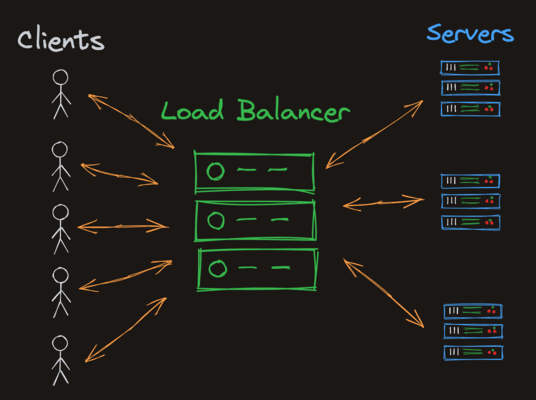

# Notes
The "Docker server" or "Docker Daemon". This listens to requests from the desktop app and executes them. If this isn't running nothing else will work.

## Container
A container is a standard unit of software that packages up code and all its dependencies so the application runs quickly and reliably from one computing environment to another.

A container gives us 95% of the benefits that virtual machines offer (at least as back-end developers), but are super lightweight. Containers boot up in seconds, while virtual machines can take minutes.

Virtual machines virtualize hardware, they emulate what a physical computer does at a very low level. Containers virtualize at the operating system level. Isolation between containers that are running on the same machine is still really good. For the most part, it appears to each container as if it has its own operating and filesystem. In reality, a lot of resources are being shared, but they're being shared securely through namespaces.

## Image and Container

- A "docker image" is the read-only definition of a container
- A "docker container" is a virtualized read-write environment

***A container is essentially just an image that's actively running.***

The netstat shows us which programs are bound to which ports:
```bash
docker exec CONTAINER_ID netstat -ltnp
```

To start a shell session running within the container itself.
```bash
docker exec -it CONTAINER_ID /bin/sh
```

## Multiple containers
In the -p XX:YY flag, the XX is the host port, while YY is the port within the container. We keep using port 80 within each container because that's the port that Nginx is serving the webpage to within the container.

```bash
docker run -d -p XX:80 docker/getting-started
```

***Each being served from different containers and different running processes.***

## Statefulness
Many docker containers are "stateless", or at least stateless in the persistent sense. That is, when you create a new container from the same image, it won't store any information from before. When you spin up a new container by running `docker run docker/getting-started`, for example, you're starting from scratch.

Docker does have ways to support a "persistent state", and the recommended way is through storage **volumes**.

The `-v ghost-vol:/var/lib/ghost/content` flag binds to a "ghost-vol" volume if it exists, otherwise, it creates it automatically!

- Use docker ps -a to find all your containers and remove them.
- Use docker volume ls to find all of your volumes and remove them.

For security reasons. You might want to remove the network connection from a container in one of these scenarios:

- You're running 3rd party code that you don't trust, and it shouldn't need network access
- You're building an e-learning site, and you're allowing students to execute code on your machines
- You know a container has a virus that's sending malicious requests over the internet, and you want to do an audit

## Load balancers

### Definition
A load balancer behaves as advertised: it balances a load of network traffic. Think of a huge website like Google.com. There's no way that a single server (literally a single computer) could handle all of the Google searches for the entire world. Google uses load balancers to route requests to different servers.

***Simply put: forwards network requests to other back-end servers***

### How it work
A central server, called the "load balancer", receives traffic from users (aka clients), then routes those raw requests to different back-end application servers. In the case of Google, this splits the world's traffic across potentially many different thousands of computers.



### What it "balance"
- A good load balancer sends more traffic to servers that have unused resources (CPU and memory).
- The goal is to "balance the load" evenly. We don't want any individual server to fail due to too much traffic. There are many strategies that load balancers use, but a simple strategy is the "round robin". Requests are simply routed one after the other to different back-end servers.

## Custom Network
Docker allows us to create custom bridge networks so that our containers can communicate with each other if we want them to, but remain otherwise isolated. We're going to build a system where the application servers are hidden within a custom network, and only our load balancer is exposed to the host.

```bash
docker network create caddytest

docker network ls

docker run --network caddytest --name caddy1 -v $PWD/020-learn-docker/index1.html:/usr/share/caddy/index.html caddy

docker run --network caddytest --name caddy2 -v $PWD/020-learn-docker/index2.html:/usr/share/caddy/index.html caddy

docker run -it --network caddytest docker/getting-started /bin/sh

# Can test with
curl caddy1
curl caddy2
```